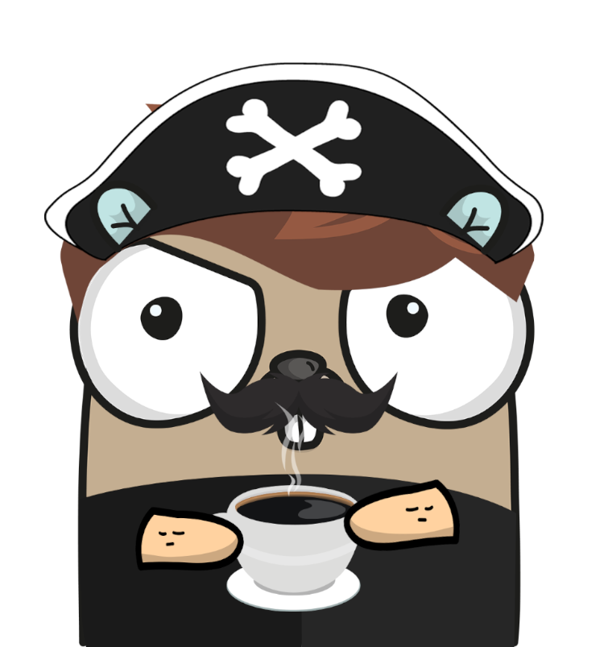

# LockNKey

More details to be populated...

## Credits

The Go gopher was created by [Shivam Mehta](https://github.com/maniac-en/) with [gopherize.me](https://gopherize.me/), based on original artwork from [Renee French](http://reneefrench.blogspot.com/).

## License

The MIT License (MIT) — [Shivam Mehta](https://github.com/maniac-en/). Please have a look at the [LICENSE](LICENSE) for more details.
